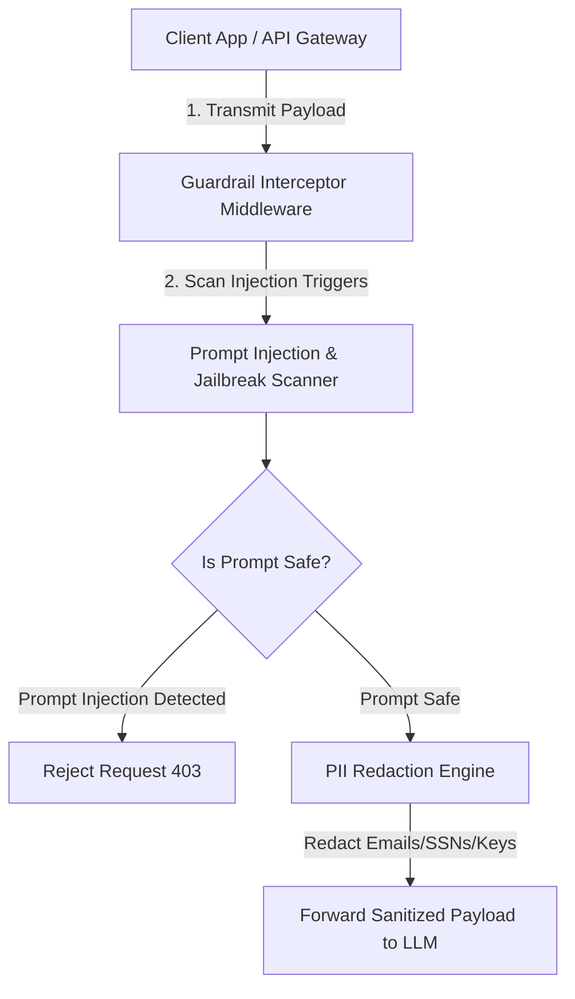

<div align="center">


# guardrail-validator

### Enterprise LLM Safety Guardrails, PII Redaction & Prompt Injection Interceptor

[](https://devopstrio.co.uk)
[](https://python.org)
[](https://devopstrio.co.uk)

</div>

---

## 🛡️ Enterprise Security Policy & Guardrail Overview

The **Guardrail Validator** provides real-time security validation, PII redaction, and prompt injection interception for enterprise AI applications. Deploying LLMs in production requires intercepting inputs *before* reaching LLM endpoints to prevent data leakage and jailbreak attacks.

This middleware engine redacts sensitive PII (Emails, SSNs, API Keys) via `PIISanitizerEngine` and blocks malicious system overrides via `PromptInjectionScanner`.


---

## 🔄 Guardrail Interception Flow



---

## 📂 Repository Directory Layout

```
guardrail-validator/
├── .github/
│   └── workflows/
│       └── guardrail-ci.yml    # CI build pipeline
├── docs/
│   ├── ARCHITECTURE.md          # Architecture specification document
│   ├── deployment-guide.md      # Integration & deployment guide
│   └── images/
│       └── architecture_diagram.jpg # Crisp white blueprint visual
├── guardrails/
│   ├── __init__.py
│   ├── pii_sanitizer.py         # PII email, SSN & key redaction engine
│   ├── prompt_injection.py      # Jailbreak & injection scanner
│   ├── safety_validator.py      # Combined guardrail validator
│   └── middleware.py            # API Gateway interceptor middleware
├── tests/
│   ├── __init__.py
│   ├── test_pii_sanitizer.py    # PII sanitizer unit tests
│   ├── test_prompt_injection.py # Injection scanner unit tests
│   └── test_safety_validator.py# Validator integration tests
├── setup.py                     # Setuptools setup() stub
├── pyproject.toml               # PEP 621 build configuration
├── requirements.txt             # Dependencies
├── pytest.ini                   # Pytest configuration
└── README.md                    # Security Playbook documentation
```

---

## 🚀 Quick Start Guide

### 1. Installation

```bash
# Clone repository
git clone https://github.com/Devopstrio/guardrail-validator.git
cd guardrail-validator

# Install in editable mode
pip install -e .
```

### 2. Integration Example

```python
from guardrails.safety_validator import SafetyGuardrailValidator

validator = SafetyGuardrailValidator()
result = validator.validate_request("Contact support at admin@devopstrio.co.uk")

print("Status:", result["status"])
print("Sanitized Prompt:", result["sanitized_prompt"])
```

### 3. Run Pytest Suite

```bash
python -m pytest -v tests/
```

<div align="center">

<sub>&copy; 2026 Devopstrio &mdash; Engineering Uninterrupted Global Workforce Productivity.</sub>

</div>
